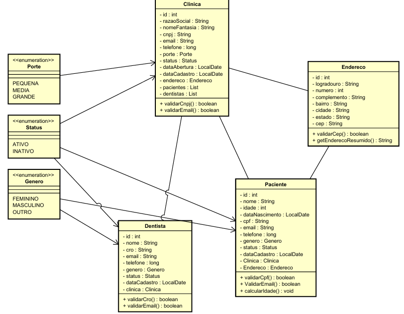
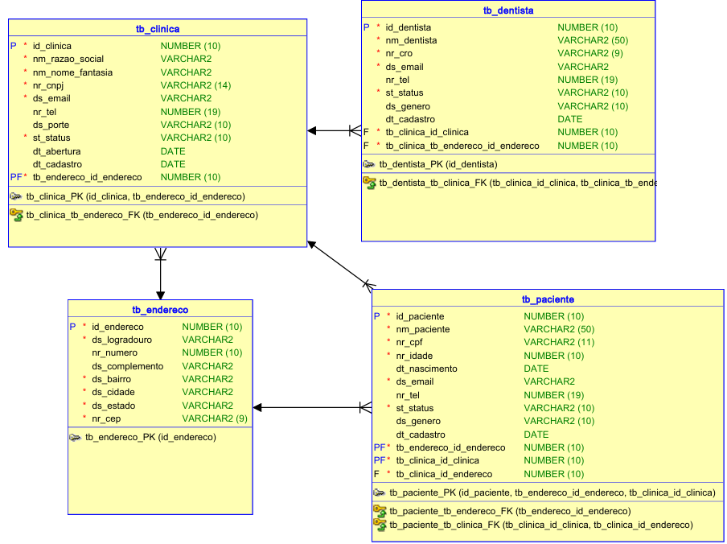

# Sprints - Java Advanced

## Repositório criado para realizar as entregas das Sprints do Challenge da Odontoprev

## Equipe
- **Larissa Araújo Gama Alvarenga** — 96496 - 2TDSPS
- **Larissa Lopes Oliveira** — 552628 - 2TDSPC
- **Luna Faustino Lima** — 552473 - 2TDSPS

## Objetivo da Solução

Este projeto tem como objetivo desenvolver um sistema de gestão para clínicas odontológicas, permitindo o cadastro, consulta, atualização e remoção de informações sobre clínicas, dentistas e pacientes. O sistema visa facilitar o gerenciamento dos dados e relacionamentos entre estas entidades, proporcionando uma interface web intuitiva para administração.

## Link Vídeo YouTube

https://www.youtube.com/watch?v=SyTqWdefHxs

## Arquitetura da Solução

O projeto segue uma arquitetura baseada no padrão MVC, implementada com Spring Boot e Thymeleaf. A estrutura do projeto está organizada da seguinte forma:

### 1. Camada Model:
- Classes de domínio que representam as entidades do sistema (Clinica, Dentista, Paciente, Endereco)
- Enums que representam estados e categorias (Status, Genero, Porte)
- Responsável pela lógica de negócio e validações específicas do domínio

### 2. Camada View:
- Templates Thymeleaf para renderização das páginas HTML
- Formulários para entrada de dados
- Interfaces de listagem e visualização de registros
- Integração com Bootstrap para estilização responsiva

### 3. Camada Controller:
- Controllers Spring MVC para tratamento das requisições HTTP
- Mapeamento de rotas e endpoints REST
- Validação de entrada de dados
- Redirecionamento e gerenciamento de mensagens flash

### 4. Camada Service:
- Implementa regras de negócio mais complexas
- Orquestra operações entre múltiplos repositories
- Gerencia transações
- Realiza validações adicionais

### 5. Camada Repository:
- Interfaces Spring Data JPA para operações com o banco de dados
- Métodos customizados para consultas específicas

### 6. Camada DTO:
- Classes para transferência de dados entre camadas
- Conversores entre DTOs e entidades
- Validação de dados de entrada com anotações Jakarta

## Funcionamento da Aplicação

O sistema permite:

### 1. Gestão de Clínicas:
- Cadastro de novas clínicas com dados como CNPJ, razão social, nome fantasia, contato e endereço
- Listagem de todas as clínicas cadastradas
- Visualização detalhada de uma clínica específica
- Edição dos dados de uma clínica existente
- Exclusão de clínicas

### 2. Gestão de Dentistas:
- Cadastro de dentistas com CRO, nome, gênero e associação a uma clínica
- Listagem de dentistas
- Visualização de detalhes de cada dentista
- Edição e exclusão de dentistas

### 3. Gestão de Pacientes:
- Cadastro de pacientes com CPF, dados pessoais, contato e endereço
- Vinculação de pacientes a clínicas específicas
- Visualização e edição de dados dos pacientes
- Exclusão de pacientes

O fluxo de navegação permite acessar as diferentes seções através de um menu principal, e cada seção apresenta operações CRUD completas para a respectiva entidade.

## Dificuldades Encontradas até o Momento

Durante o desenvolvimento, enfrentamos algumas dificuldades:

1. **Validação de Formulários:** Encontramos desafios na validação de formulários com objetos aninhados, especialmente para os endereços. A falta de setters ou a não inicialização de objetos aninhados nos DTOs causou problemas de binding durante a submissão de formulários.

2. **Conversão de Enums em Formulários:** Tivemos dificuldades na conversão entre strings e enums nos formulários, principalmente quando o valor do campo era a descrição do enum e não o nome da constante.

3. **Cálculo Automático de Valores:** A automatização do cálculo da idade do paciente a partir da data de nascimento apresentou desafios na validação e persistência.

## Próximos Passos

Para a próxima etapa do desenvolvimento (Sprint 4), implementaremos:

1. **Autenticação e Segurança:** Implementar Spring Security com gestão de perfis de segurança, permitindo diferentes níveis de acesso.

2. **Internacionalização:** Adicionar suporte para múltiplos idiomas na interface do usuário, permitindo que o sistema seja utilizado em diferentes regiões.

3. **Mensageria:** Configurar recursos de mensageria com produtores e consumidores.

4. **Monitoramento:** Implementar Spring Boot Actuator para monitoramento da aplicação, coletando métricas.

5. **Inteligência Artificial:** Integrar recursos de IA utilizando o framework Spring AI.

## Diagrama de Classes

## Diagrama Entidade-Relacionamento

